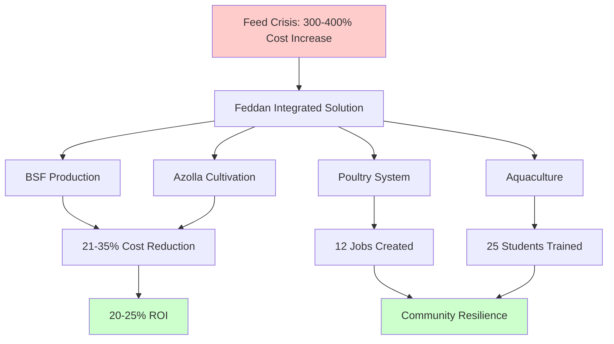
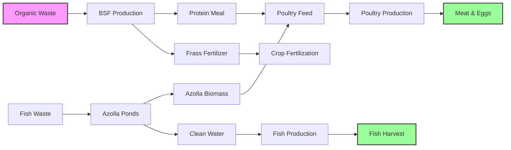
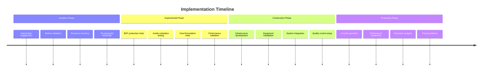
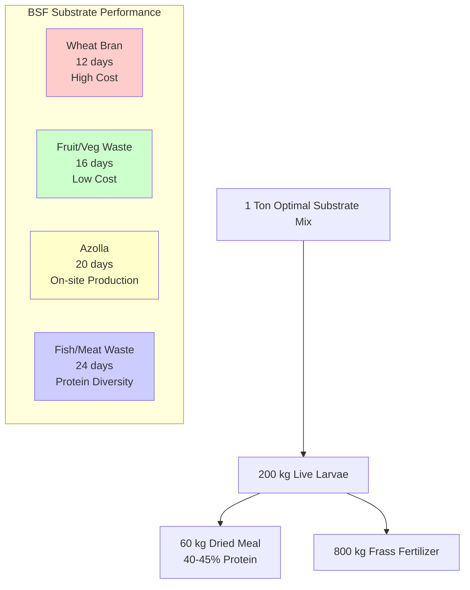
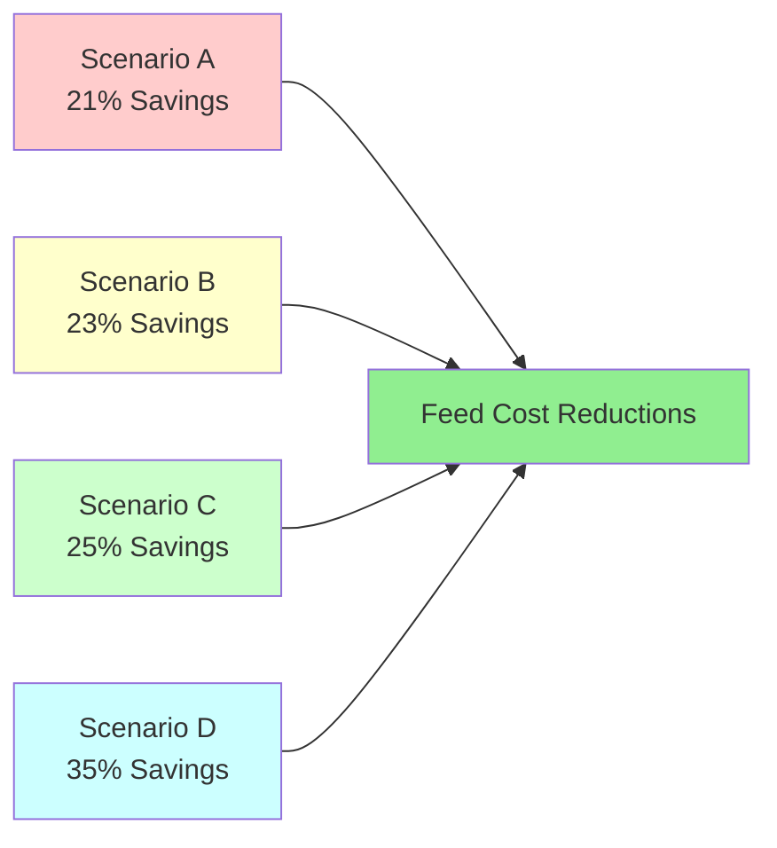
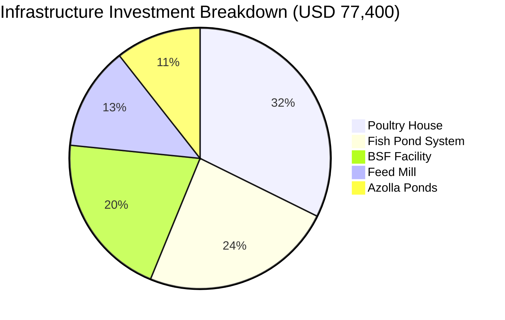
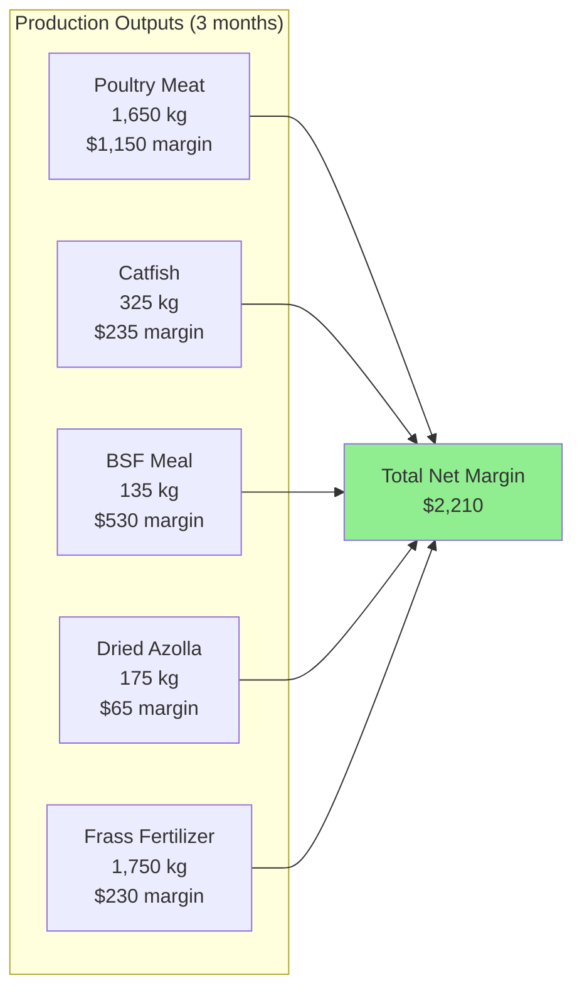
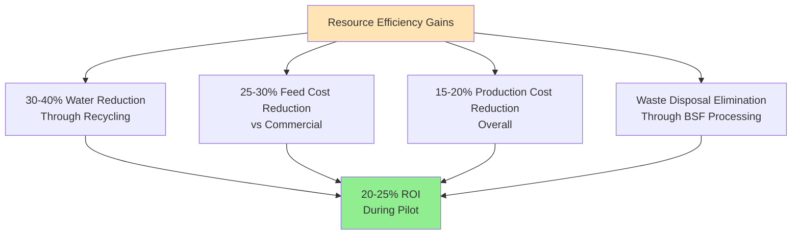
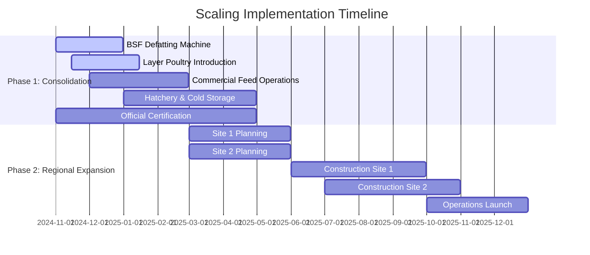

# FEDDAN INTEGRATED FARMING PILOT PROJECT
## Final Implementation Report

**United Nations Development Programme - Sudan Country Office**

**Project Duration:** June - October 2024  
**Location:** Kassala State, Sudan  
**Lead Partner:** University of Kassala  
**Technical Partner:** Alzree Alsudani  
**Total Investment:** USD 77,400.62

---

## EXECUTIVE SUMMARY

The Feddan Pilot Project successfully demonstrated an innovative integrated farming model that addresses Sudan's agricultural crisis through locally-produced alternative protein sources. Implemented during Sudan's ongoing conflict when feed prices increased 300-400%, the project validated a one-feddan system combining poultry, aquaculture, Black Soldier Fly (BSF) larvae production, and Azolla cultivation.

The pilot achieved significant cost reductions ranging from 21-35% in feed expenses through alternative protein sources while generating 20-25% return on investment within the pilot period. Technical validation confirmed BSF and Azolla as viable protein alternatives, with successful integration demonstrating circular resource flows. The project created 12 permanent jobs and provided training for 25 students, establishing a foundation for broader scaling as an early recovery solution in stabilizing areas of Sudan.

---

## SYSTEM OVERVIEW DIAGRAM

---

## 1. PROJECT CONTEXT AND RATIONALE

### Crisis Response Framework

Sudan's agricultural sector faced unprecedented challenges following the April 2023 conflict outbreak. Traditional livestock farming became economically unsustainable as imported protein concentrate costs surged 300-400%. Trade route disruptions, inaccessible agricultural areas, and limited credit access compounded the crisis, creating urgent demand for locally-based solutions that could operate independently of external supply chains.

The Feddan model addresses these challenges through integrated production systems where component outputs become inputs for other components. This circular design reduces external input dependence while maximizing resource efficiency within a small footprint.

---

## CIRCULAR RESOURCE FLOW DIAGRAM

---

The approach integrates poultry production using alternative protein feeds, aquaculture systems with water management, Black Soldier Fly larvae converting organic waste to protein, and Azolla cultivation providing supplemental feed and water purification.

Recent stabilization in key production areas including Khartoum, Sennar, and Gezira creates opportunities for agricultural recovery interventions. The proven Feddan concept provides a replicable model for jump-starting local production and restoring livelihoods in newly accessible areas where conventional farming remains economically challenging.

---

## 2. IMPLEMENTATION METHODOLOGY

Implementation followed four sequential phases designed to build evidence progressively while managing risks and stakeholder expectations.

---

## IMPLEMENTATION TIMELINE

---

The inception and market validation phase involved intensive stakeholder engagement across government, academic, and private sectors. Market assessment confirmed the severe feed cost burden and supply challenges while resource inventory identified abundant organic waste streams suitable for alternative protein production. A validation workshop with 35 participants including state ministry officials, university faculty, private sector representatives, and farmer organization leaders endorsed the project concept while emphasizing the need for practical demonstrations.

The experimental validation phase focused on technical feasibility testing. BSF production trials optimized substrate mixtures and growing conditions while Azolla cultivation testing determined yield potential and nutritional value. Feed formulation trials integrated alternative protein sources into practical livestock diets, with performance validation through controlled feeding studies confirming nutritional adequacy and animal acceptance.

Infrastructure construction transformed experimental results into operational reality through systematic development of integrated facilities. The design enabled resource flows between components while utilizing local materials adapted for Sudan's climate conditions. Modular systems supported operational efficiency and biosecurity while processing equipment completed the waste-to-protein conversion chain.

The production integration phase validated the core hypothesis that integrated systems could generate synergies exceeding individual component performance. Three months of continuous operation demonstrated consistent output while revealing both operational efficiencies and management challenges. Daily monitoring of all components provided comprehensive data on resource flows, production rates, and economic performance.

---

## 3. TECHNICAL ACHIEVEMENTS

### Black Soldier Fly Production System

BSF larvae demonstrated exceptional efficiency in converting organic waste to high-quality protein under Sudanese conditions. Optimization trials identified optimal substrate combinations balancing cost, availability, and performance. The system achieved a 14-day average cycle from egg to harvest under optimal conditions, producing 200 kg live larvae per ton of substrate processed. After processing, this yielded 60 kg of dried larvae meal containing 40-45% protein content alongside 800 kg of valuable frass fertilizer as a co-product.

---

## BSF SUBSTRATE PERFORMANCE DIAGRAM

---

Substrate optimization revealed important trade-offs between cost and performance. Wheat bran supported the fastest growth at 12 days but represented the highest cost input. Fruit and vegetable waste performed well at 16 days while offering minimal cost and excellent availability from urban markets. Azolla substrate required 20 days but could be produced on-site, creating internal synergies. Fish and meat waste showed the longest cycle at 24 days but provided valuable protein diversity for the final product.

Nutritional analysis confirmed BSF larvae as a premium protein source comparable to fishmeal and superior to soybean meal in several parameters. Dried larvae contained 40-45% protein while defatted meal reached 50-60% protein concentration. Perhaps more importantly, BSF provided beneficial compounds like lauric acid and chitin that offered immune system benefits for livestock, potentially improving health outcomes beyond simple nutritional substitution.

### Azolla Cultivation Systems

Azolla production achieved remarkable yields with minimal environmental impact through optimized pond management and harvesting protocols. Two adjacent ponds each measuring 100 square meters generated 250-500 kg of fresh Azolla weekly under optimal conditions, yielding 25-60 kg of dried product. The rapid multiplication rate meant that small starter cultures could reach full production within three to four weeks, making system establishment relatively straightforward.

---

## AZOLLA PRODUCTION PERFORMANCE TABLE

| Pond Size (m²) | Weekly Fresh Yield (kg) | Weekly Dried Yield (kg) | Production Cost (USD/week) | Cost per kg Dried (USD) |
|----------------|-------------------------|-------------------------|----------------------------|-------------------------|
| 100 | 250-500 | 25-60 | 39-70 | 0.65-1.60 |
| 200 | 500-900 | 50-110 | 70-120 | 0.63-1.40 |
| 500 | 1,100-2,000 | 120-240 | 150-250 | 0.60-1.25 |

---

The cultivation process required careful attention to water quality, nutrient levels, and harvesting schedules. Azolla thrived in shallow water with pH levels between 6.5-7.5 and absorbed nitrogen directly from the water, improving overall pond quality while producing biomass. Light fertilization with diammonium phosphate provided essential phosphorus while limiting nitrogen additions that could inhibit growth. Regular harvesting every 7-10 days maintained production quality and prevented overcrowding.

Nutritional analysis showed dried Azolla containing 20-25% protein, making it a valuable feed supplement though less concentrated than BSF larvae. However, Azolla offered additional benefits including water purification, rapid reproduction, and minimal processing requirements. Poultry readily accepted 3-5% inclusion rates while fish tolerated higher levels without performance reduction. Production costs ranged from $0.65-1.60 per kg of dried product, with larger pond systems achieving better labor efficiency and reduced per-unit costs.

### Feed Formulation Innovation

Systematic feed trials validated four scenarios replacing conventional ingredients with BSF and Azolla alternatives while maintaining nutritional adequacy. The reference commercial diet contained 27.1% crude protein and cost 1,189,000 SDG per ton, serving as the benchmark for all comparisons.

---

## FEED FORMULATION SCENARIOS TABLE

| Scenario | BSF Type & Amount | Azolla % | Cost Reduction | Key Benefits |
|----------|-------------------|----------|----------------|--------------|
| A: Full-fat BSF | 80 kg/ton full-fat | 0% | 21% | Eliminates vegetable oil |
| B: Defatted BSF + oil | 120 kg/ton defatted | 0% | 23% | Higher protein inclusion |
| C: Defatted BSF + BSF oil | 120 kg/ton defatted | 0% | 25% | Import independence |
| D: BSF + Azolla | 120 kg/ton defatted | 10% | 35% | Maximum cost reduction |

---

## FEED COST SAVINGS COMPARISON

---

Scenario A incorporated 80 kg per ton of full-fat BSF meal, eliminating the need for vegetable oil while maintaining nutritional balance. This approach achieved 21% cost reduction compared to the reference diet. Scenario B used 120 kg per ton of defatted BSF meal with minimal vegetable oil, allowing higher protein inclusion without excess fat and generating 23% cost savings.

Scenario C replaced vegetable oil entirely with BSF oil while maintaining defatted BSF meal inclusion, achieving 25% cost reduction and complete independence from imported oil. The most ambitious Scenario D combined defatted BSF meal and BSF oil with 10% Azolla inclusion, producing the highest cost savings at 35% while requiring careful fiber management to maintain digestibility.

---

## LIVESTOCK PERFORMANCE VALIDATION TABLE

| Diet Formulation | Final Weight (g) | Feed Conversion Ratio | Feed Cost per kg Meat (USD) | Cost Reduction (%) |
|------------------|------------------|-----------------------|-----------------------------|-------------------|
| Commercial Control | 2,450 | 1.55 | 2.85 | -- |
| BSF-20% + Azolla-3% | 2,465 | 1.53 | 2.50 | 12% |
| BSF-30% + Azolla-5% | 2,440 | 1.52 | 2.40 | 16% |

---

Livestock performance validation confirmed that all experimental diets achieved final weights equivalent to commercial controls while demonstrating improved feed conversion efficiency. Cost reductions ranged from 8-16% per kilogram of meat produced, with enhanced health indicators including improved feather quality and reduced mortality suggesting additional benefits from BSF inclusion beyond simple cost substitution.

---

## 4. ECONOMIC PERFORMANCE

### Investment and Infrastructure

Total project investment of USD 77,400 created integrated infrastructure supporting diversified production across five components.

---

## INFRASTRUCTURE INVESTMENT BREAKDOWN

---

## INFRASTRUCTURE COMPONENTS TABLE

| Component | Investment (USD) | Capacity | Key Features |
|-----------|------------------|----------|--------------|
| Poultry House | 25,000 | 700 birds | Climate control, automated feeding |
| Fish Pond System | 18,500 | 5,000 fish | Filtration, aeration, water exchange |
| BSF Facility | 15,800 | 100 kg/day | Climate control, processing equipment |
| Feed Mill | 9,900 | 500 kg/day | Mixing, storage, quality control |
| Azolla Ponds | 8,200 | 200 m² | Harvesting systems, shade nets |
| **Total** | **77,400** | -- | Integrated resource flows |

---

The poultry house accommodated 700 birds with climate control and automated feeding systems for $25,000. Fish pond systems supporting 5,000 fish with filtration and aeration cost $18,500. The BSF facility processing 100 kg daily with climate control and processing equipment required $15,800. Feed mill capacity of 500 kg daily with mixing and storage systems cost $9,900, while Azolla ponds covering 200 square meters with harvesting systems required $8,200.

### Revenue Generation and Profitability

Three months of production operation demonstrated sustainable economic performance across diversified output streams.

---

## PRODUCTION OUTPUTS FLOW DIAGRAM

---

## REVENUE GENERATION TABLE

| Product | Quantity | Market Value (USD) | Production Cost (USD) | Net Margin (USD) |
|---------|----------|--------------------|-----------------------|------------------|
| Poultry Meat | 1,650 kg | 4,950 | 3,800 | 1,150 |
| Catfish | 325 kg | 815 | 580 | 235 |
| BSF Meal | 135 kg | 850 | 320 | 530 |
| Dried Azolla | 175 kg | 150 | 85 | 65 |
| Frass Fertilizer | 1,750 kg | 350 | 120 | 230 |
| **Total System** | -- | **7,115** | **4,905** | **2,210** |

---

Poultry meat production of 1,650 kg generated $4,950 in market value against $3,800 production costs, yielding $1,150 net margin. Catfish production of 325 kg achieved $815 market value with $580 production costs for $235 net margin. BSF meal production of 135 kg commanded premium pricing of $850 against $320 production costs, generating $530 net margin.

Dried Azolla production of 175 kg earned $150 market value with $85 production costs for $65 net margin, while frass fertilizer production of 1,750 kg generated $350 market value against $120 production costs for $230 net margin. Total system performance achieved $7,115 in market value against $4,905 in production costs, yielding $2,210 net margin during the three-month production phase.

---

## RESOURCE EFFICIENCY GAINS DIAGRAM

---

Integration synergies generated substantial resource efficiency improvements compared to independent component operation. Water usage decreased by 30-40% through recycling systems between fish and Azolla ponds. Feed costs reduced by 25-30% compared to commercial alternatives while waste disposal costs were eliminated through BSF processing. Overall production costs decreased by 15-20%, creating sustainable competitive advantages extending beyond the pilot phase.

Economic analysis revealed 20-25% return on investment during the pilot period, with diversified revenue streams providing risk management benefits and enhanced cash flow stability. Market acceptance was confirmed across all product categories, with demonstration effects generating additional demand from neighboring farms interested in adopting similar approaches.

---

## 5. SOCIAL IMPACT AND KNOWLEDGE TRANSFER

### Employment and Capacity Building

The pilot exceeded employment targets while building local capacity for independent operation. Twelve permanent positions were established during the production phase, with 25 university students receiving hands-on training in integrated farming techniques. Skills transfer extended beyond technical knowledge to include business management, quality control, and marketing capabilities essential for autonomous operation. Several participants expressed interest in establishing their own systems using knowledge gained during the pilot.

Multi-stakeholder participation ensured technical credibility, market relevance, and regulatory compliance throughout implementation. University partnership provided technical oversight and land access while private sector involvement ensured commercial viability. Government endorsement facilitated regulatory compliance while community participation built local ownership and long-term sustainability.

Systematic documentation created a comprehensive knowledge base supporting replication and scaling decisions. Technical protocols for BSF and Azolla production were developed alongside feed formulation guidelines with detailed nutritional specifications. Economic analysis frameworks enable informed investment decisions while training curricula support various stakeholder groups in adopting and adapting the approach for different contexts.

---

## 6. VALIDATION OF CORE ASSUMPTIONS

The pilot successfully validated three fundamental assumptions underlying the project design. Local production of BSF and Azolla significantly reduced import dependence while maintaining livestock performance, confirmed through consistent production achievement, nutritional equivalence to commercial alternatives, and successful livestock performance trials. Feed cost reductions of 21-35% were achieved without compromising animal health or growth rates.

Integration synergies generated benefits exceeding individual component performance, demonstrated through 30-40% water efficiency gains, effective waste cycling, and enhanced economic returns compared to standalone operations. Resource flows between components created value-added opportunities while reducing overall input requirements and environmental impact.

Early indicators confirmed enhanced resilience through diversified output streams, reduced import dependence, and successful operation during crisis conditions. While extended observation would be required for complete validation, the pilot demonstrated that integrated models could maintain production and generate income even amid ongoing conflict and market disruptions.

---

## 7. LESSONS LEARNED

### Technical Insights

Climate control and consistent substrate supply emerged as essential factors for BSF production success. While the insects demonstrated remarkable efficiency under optimal conditions, maintaining those conditions required careful attention to ventilation, moisture management, and substrate quality. Scaling would require standardized protocols and comprehensive training programs to ensure consistent performance across different operators and locations.

Integration management complexity increases significantly compared to single-component operations, but the synergies justify this additional complexity when properly managed. Resource cycling generates substantial cost savings while creating additional revenue streams, though achieving these benefits demands coordination across multiple production schedules and quality standards.

Quality control systems proved essential for maintaining product standards and market acceptance. Consistent processing, appropriate storage, and standardized nutritional testing would be critical for commercial scaling where product variability could undermine market confidence and pricing premiums.

### Economic and Institutional Insights

Integration synergies require careful management to realize their full potential, but when achieved, they create sustainable competitive advantages that persist beyond initial implementation. Diversified revenue streams provide significant risk management benefits while multiple income sources enhance cash flow stability compared to single-product farming systems.

Multi-stakeholder engagement proved critical from inception through completion, with each partner contributing essential elements. University partnerships provide technical credibility and research capacity, private sector involvement ensures market relevance and commercial viability, government endorsement facilitates regulatory compliance and policy support, while community participation builds local ownership and long-term sustainability.

The psychological impact of successful demonstration often equals or exceeds the economic benefits for supporting broader agricultural recovery efforts. Participants frequently commented on the confidence-building effects of seeing productive systems operate successfully while creating employment and generating income during challenging crisis conditions.

---

## 8. SCALING STRATEGY

### Immediate Consolidation

The pilot's success necessitates a carefully sequenced scaling approach beginning with consolidation and expansion of the existing unit over the next six months.

---

## SCALING IMPLEMENTATION TIMELINE

---

Priority actions include installing a BSF defatting machine to improve protein quality and enable higher inclusion levels in feed formulations. Introducing layer poultry would fully utilize the unit's expanded capacity while providing daily cash flow from egg production.

Commercial operation of the feed mixing line should be launched to meet growing demand from small producers and private sector clients. The value chain requires strengthening through establishment of a hatchery for chicks and high-capacity cold storage facilities for poultry products. Official certification and accreditation of BSF and Azolla-based feeds must be secured through the National Plant Protection Center and Standards & Metrology Authority to enable formal market access.

### Medium-term Expansion

Once the pilot unit is consolidated and certified, two additional Feddan units should be established in different states to serve as regional demonstration sites. These units would test model adaptability under varied agro-ecological, market, and security conditions while generating the evidence base required for broader replication. Regional sites would strengthen visibility and credibility of the Feddan approach at both state and national levels.

### Long-term Vision

Systematic scaling would develop decentralized production networks supported by regional processing hubs to maintain quality standards while enabling community-level participation. Certification and quality assurance systems would ensure product consistency across multiple sites while sustainable financing mechanisms would reduce donor dependency and support autonomous operation.

---

## 9. RECOMMENDATIONS FOR SUSTAINABLE SCALING

### Institutional Framework Development

Successful scaling requires establishing a robust institutional model through registration as a non-profit company, creating the legal and organizational framework needed to access donor funding, private sector partnerships, and bank financing. A decentralized production system is recommended where local producers manage simple operations while a central hub handles complex tasks such as BSF larvae rearing, input supply, and centralized services including feed mixing, packaging, and storage.

This arrangement balances community-level participation with quality assurance and efficiency requirements, ensuring sustainable scaling while maintaining product standards. Governance frameworks must support autonomous operation while providing oversight and technical support for participating communities and producers.

### Value Chain Integration

Official certification and accreditation processes must be fast-tracked to secure acceptance in formal markets and build confidence among producers and buyers. The broader value chain should be strengthened by complementing feed production with hatcheries, cold storage facilities, and commercial feed mixing lines, thereby maximizing economic returns and supporting integrated production systems.

Market diversification should promote a range of outputs including meat, eggs, fish, chicks, and fertilizer to stabilize prices and reduce reliance on single revenue streams. The demonstration effect of successful sites must be leveraged to attract private sector partners and mobilize donor support for expanded implementation.

### Financing and Partnership Strategy

The transition from donor dependency to sustainable financing should blend grants for infrastructure development with commercial loans for working capital requirements. Revenue-generating services should be developed to support operational sustainability while partnerships with financial institutions familiar with agricultural innovation would facilitate long-term financing access.

Strategic partnerships should engage universities and technical institutes for ongoing knowledge transfer, develop private sector relationships for market access, build government connections for policy support, and create farmer networks for peer-to-peer learning and mutual support. These partnerships would ensure technical excellence, market relevance, and long-term institutional sustainability.

---

## 10. CONCLUSION

The Feddan Pilot Project successfully validated an innovative integrated farming model that addresses Sudan's agricultural crisis through locally-produced alternative protein sources. Technical feasibility was demonstrated across all components, economic viability exceeded original projections, and social impact created lasting capacity within participating communities. The project's success during challenging crisis conditions demonstrates the potential for agricultural innovation to generate both economic returns and social resilience.

Integration synergies proved substantial and sustainable, creating competitive advantages through reduced input costs and diversified revenue streams. The systematic documentation and stakeholder engagement established a solid foundation for scaling while proven economic performance provides compelling incentives for adoption by other communities and regions.

With recent stabilization in key agricultural areas, the Feddan model offers immediate potential as an early recovery intervention capable of jump-starting local production and restoring livelihoods. Success in broader implementation will depend on maintaining the multi-stakeholder approach, ensuring quality standards across decentralized operations, and developing sustainable financing mechanisms that reduce donor dependency while supporting community ownership.

The Feddan approach represents more than technical innovation. It demonstrates how agricultural systems can build hope, create employment, and generate momentum for broader recovery efforts even amid ongoing challenges. This confidence-building dimension may prove as valuable as the economic benefits for supporting Sudan's agricultural sector recovery and rural community resilience.
